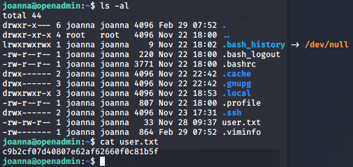

# OpenAdmin
## About the Box
The box is running on 10.10.10.171.dsads
ihdfiuoa

## Recon/Enumeration
Run an initial `nmap` scan to check for open ports and services:

We see there is ssh open on port 22 and an Apache httpd server open on port 80.

Opening a browser and loading `10.10.10.171` into the URL bar takes us to this home page:

This is a default Apache Ubuntu page that doesn't really tell me much, so I run `gobuster` to bruteforce search for pages and directories:

There wasn't anything apart from dummy text in `/artwork` but `/music`was a bit more insightful:

In the top right corner, the `Login` button actually directs you to a new page `/ona`:

## Getting the User Flag

I put a single quote (`'`) in the search box to test if the site was vulnerable to SQL injection but to no avail.

I tried to change the login from guest to admin by trying passwords like "admin" and "password" but no luck.

After a while I realised the obvious thing on the page. The OpenNetAdmin service was out of date, so there could potentially be an exploit which I searched for using `searchsploit`:

Lo and behold there is an RCE (remote code execution) vulnerability for ONA for OpenNetAdmin 18.1.1 which coincidentally is the exact version that the server is running. So I copied the shell script to my working directory.

I ran the exploit but encountered some errors:

After some googling I discovered the issue was that the Bash script was using DOS-style CRLF endings so I ran `dos2unix` which was enough to make the script run:

So I ran the exploit, specifying the `/ona/` path and I got a reverse shell:

After testing some commands, it turned out that only `cat` and `ls` was permitted in this shell, so we need to try and find some `ssh` credentials to get proper access to the machine.

I opened `/etc/passwd` to try identify the users on the machine:

So apart from `root` we know that there is also `jimmy` and `joanna`. Not knowing where to go from here I just used `ls` to see the directory structure of the file system, trying to identify where useful stuff may be:

First I checked the files in the `config` folder, where I found a potential password `mysecretbindpassword` in `config/auth_ldap.config.php`:

But this password didn't work for `jimmy` or `joanna` so I investigated the `local/config` folder:

In `database_settings.inc.php` I found another potential password:

This time I had struck gold and `n1nj4W4rri0R!` worked to login as `jimmy` through `ssh`:

However, the flag is not on this account, so clearly we need access to `joanna`. So I ran `ls` to see what I had to work with:

I went through the 3 files and `main.php` was the most interesting:

It seems that when this file runs, it will output joanna's RSA key likely used to authenticate with `ssh`. First to test my luck I used the ninja password to login as `joanna` over ssh as the file mentioned, but this didn't work. So I likely will need the RSA key.

I tried to use `curl` to serve this file through `localhost` but there was no success and I needed a port number. So I ran `netstat` with the `-tl` argument to find open ports listening over TCP:

I ran `curl` again on `localhost:52846` and attained the RSA key:

I saved this private key to a file called `rsa_priv` and ran `john` to crack it:

So turns out there's another "ninja" password which is `bloodninjas`. I tried to login as `joanna` with this but again no success.

After getting frustrated I realised I missed the obvious. I have to use the RSA key with `ssh`. So I gave this a try:

Definitely made some progress but now there is a permissions issue so I fixed this with `chmod`, logged in as `joanna` with the `bloodninjas` password and we're in:

I check what we have with `ls` and we have attained the user flag:

## Getting the Root Flag

Note: At this point I was beyond out of my depth since I don't know how to perform privilege escalation. So I watched a few walkthroughs of older retired HTB machines and read about SUID file permissions which grant an application root access when executed by a normal user.

So I tried to find the files with SUID permissions:

However this didn't tell me much. I needed a way to see what `joanna`'s permissions allow her to do. Apparently this is exactly what the `sudo -l` command was made to do, so I used that:

As it turns out we have the ability to run a single command as root without needing to enter the password. In this case it is opening a file with `nano`. This implies that through the `nano` editor I'll be able to access the `root` user's files since I now have the permissions. In nano I did `ctrl+r` to read in a file and then `ctrl+t` to select a file. Through here I could see that there was a `root.txt`:

I selected the file and it read in the contents of `root.txt` and placed it above the contents of `/opt/priv`. The root flag has been attained.

