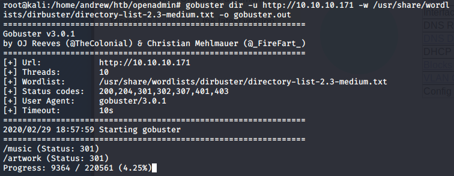

# OpenAdmin
## About the Box
The box is running on 10.10.10.171.dsads
ihdfiuoa

## Recon/Enumeration
Run an initial `nmap` scan to check for open ports and services:

We see there is ssh open on port 22 and an Apache httpd server open on port 80.

Opening a browser and loading `10.10.10.171` into the URL bar takes us to this home page:

This is a default Apache Ubuntu page that doesn't really tell me much, so I run `gobuster` to bruteforce search for pages and directories:

There wasn't anything apart from dummy text in `/artwork` but `/music`was a bit more insightful:

In the top right corner, the `Login` button actually directs you to a new page `/ona`:

## Getting the User Flag

I put a single quote (`'`) in the search box to test if the site was vulnerable to SQL injection but to no avail.

I tried to change the login from guest to admin by trying passwords like "admin" and "password" but no luck.

After a while I realised the obvious thing on the page. The OpenNetAdmin service was out of date, so there could potentially be an exploit which I searched for using `searchsploit`:

Lo and behold there is an RCE (remote code execution) vulnerability for ONA for OpenNetAdmin 18.1.1 which coincidentally is the exact version that the server is running. So I copied the shell script to my working directory.

I ran the exploit but encountered some errors:

After some googling I discovered the issue was that the Bash script was using DOS-style CRLF endings so I ran `dos2unix` which was enough to make the script run:

So I ran the exploit, specifying the `/ona/` path and I got a reverse shell:

After testing some commands, it turned out that only `cat` and `ls` was permitted in this shell, so we need to try and find some `ssh` credentials to get proper access to the machine.

## Getting the Root Flag